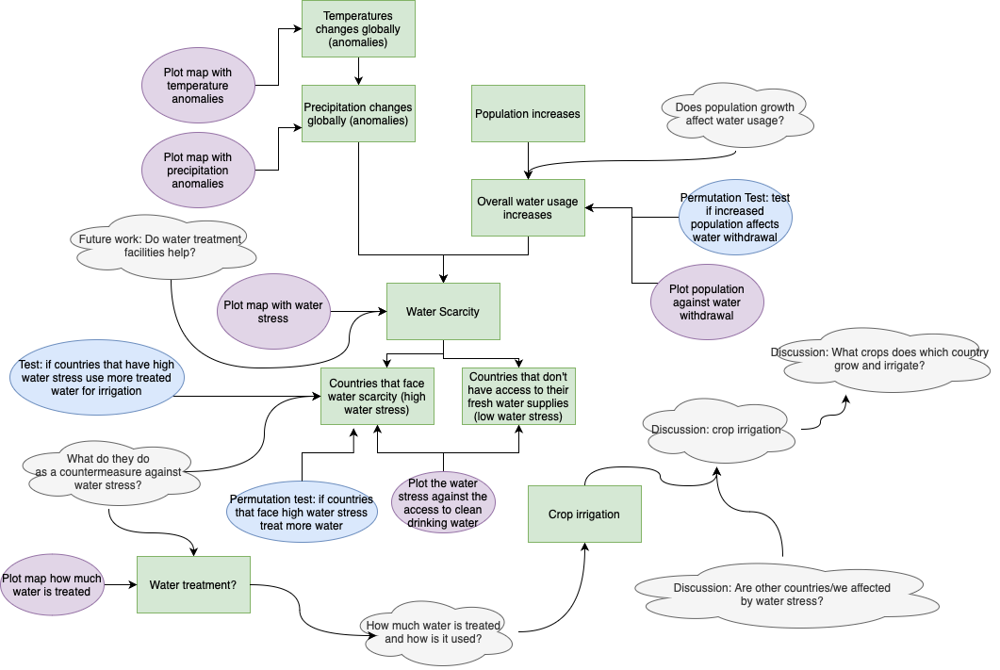

# Assessing the Blue Planet: A Comprehensive Study of Global Water Resources

## Getting started

### Requirements

Make sure you have the following requirements are satisfied before you start:

- LaTeX compiler, e.g., `pdflatex`
- [`python` version 3 and `pip`](https://www.python.org/downloads/)
- [`virtualenv`](https://docs.python.org/3/library/venv.html)

If python is already installed, check if its version is `Python 3.1x.x`

```shell
python --version
```

### Prepare the environment

This project uses a virtual environment to avoid the pollution of the host python system.
Follow the steps to activate the virtual environment and install the necessary requirements.

Create the virtual environment:

```shell
python3 -m venv .venv
```

You should see a new directory called .venv. This contains `python`, `pip` and libraries.

Activate the virtual environment:

```shell
source .venv/bin/activate
```

Install the required packages:

```shell
pip install -r requirements.txt
```

---

**Important:**

Make sure that your IDE uses the virtual environment too.
In PyCharm, for example, you can set the Python interpreter in `Settings > Project > Project Interpreter`.
The interpreter for the virtual environment is located in `.venv/bin/python`.

---

### Deactivate the environment

If you don't need the environment anymore, you can deactivate it:

```
deactivate
```

## Create the paper

Before compiling, please make sure that the requirements above are satisfied
**and** the required $\LaTeX$-packages in `doc/paper.tex` are installed.
If not, it might still compile, but have may have missing elements.

### Compile the paper

To compile the `paper.tex` file in `doc` you call `./compile-paper.py`.
Make sure that the python environment is set up the way it's specified above.

```shell
./compile-paper.py
```

## Paper structure and plan



### Question 1: "Which regions are mostly affected by climate change in terms of renewable water availability?":

#### 1. Analyze Precipitation Data

Why? Because water availability is likely linked to rainfall.

Find some literature that shows that this is true.
We don't have to look at total exploitable water resources since we _know_ that rain might be one of the biggest
exploitable water resources

#### 2. Identify Regions with Low Precipitation

1. Plot spatial data as global plot: [Notebook](./exp/exp_global_precipitation.ipynb)
   -> Rainfall did not decline, but its distribution changed over time

2. Identify regions where the precipitation is low
   -> these are regions that are likely to be affected by water scarcity

### Question 2: "Which water management strategies are used by regions with high levels of water stress?"

#### 1. Map of Global Water Management Strategies

Plot which water management strategies are used globally [Notebook](./exp/exp_global_water_management_strategies.ipynb)
-> look at all water management strategies for each country and plot the proportion of the strategy

#### 2. Comparative Analysis

Compare countries which are mostly affected by water scarcity to the global trend

1. Null hypothesis: "There is no difference in water management strategies between countries affected by water scarcity
   and the global trend."
2. Regression: Water Scarcity as Input -> Water Treatment as Output
   Is there a degree of regression?: -> "The higher the Scarcity, the higher the Water Treatment."
3. ANOVA for categorizing and comparing regional water management strategies.
